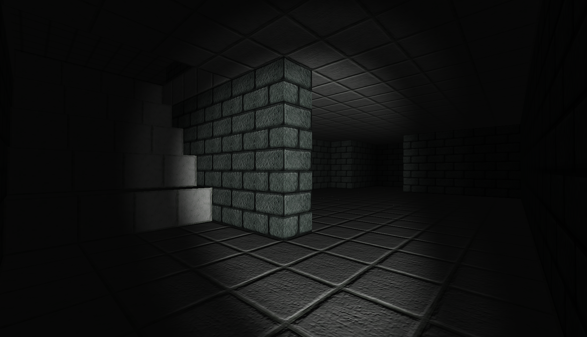

# Block-Script

A 3 Dimensional voxel maze game, built with [threejs](http://threejs.org).

## Play now

[Play Online](block-script.rdfriedl.com)

## CreditsPlay

**_Images / Textures_**

* All block textures are from: [Dokucraft](http://dokucraft.co.uk/)

**_Fonts_**

* All fonts are from: [iamcal.com](http://www.iamcal.com/misc/fonts)
